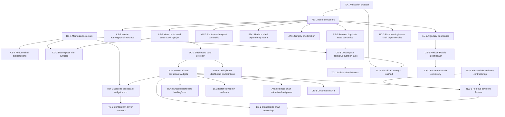

# Frontend Performance Optimization Master Plan

Planning only. This document converts the findings from:
- [frontend-performance-rca.md](./frontend-performance-rca.md)
- [frontend-performance-static-audit.md](./frontend-performance-static-audit.md)

It does **not** repeat those audits, and it does **not** propose business-logic changes. It is an execution roadmap for implementing frontend performance improvements incrementally and safely.

## Executive Summary
The optimization program should start with the areas that have the highest user impact and the clearest evidence from Phase 1 and Phase 2:
1. shrink `App.jsx` shell ownership
2. fully centralize dashboard widget data ownership
3. remove dashboard request fan-out, especially payment-series fan-out
4. reduce rerender scope through selector, prop, and state-boundary work
5. only then pursue broader bundle, CSS, and ecosystem cleanup

The highest-ROI sequence is architectural first, micro-optimization second. The current frontend’s largest bottlenecks come from:
- shell-level orchestration breadth
- dashboard-wide state propagation
- fragmented widget fetch ownership
- duplicate endpoint consumption
- chart and table modules that behave like sub-applications
- global dependency and CSS reach that increase startup cost

This roadmap is organized so that:
- each phase is independently deployable
- each task is independently reviewable and testable
- regression risk is controlled by keeping data, routing, and UI boundaries explicit
- runtime profiling can be added during implementation validation without blocking planning

## Optimization Strategy
The implementation strategy is:
1. **Create stable architectural boundaries first**
   - route containers
   - dashboard data layer
   - clearer state ownership
2. **Reduce rerender and fetch amplification second**
   - selector memoization
   - stable widget props
   - request deduplication
   - chart/table containment
3. **Reduce startup and platform overhead third**
   - lazy boundary improvements
   - dependency rationalization
   - CSS reach reduction
   - animation cleanup
4. **Use each completed phase to unlock the next**
   - shell decomposition unlocks route isolation
   - dashboard data layer unlocks render optimization
   - network normalization unlocks chart simplification
   - bundle cleanup becomes lower-risk after ownership is clearer

## Workstreams
1. Application Shell
2. Dashboard Data Layer
3. Network Optimization
4. Redux and State Architecture
5. Rendering Optimization
6. Component Decomposition
7. Bundle and Dependency Optimization
8. Lazy Loading and Route Isolation
9. CSS and Styling Cleanup
10. Animation and Interaction Cleanup
11. Table and Chart Containment
12. Technical Debt and Validation Infrastructure

## Workstreams, Epics, and Tasks

### Workstream 1: Application Shell
Goal: turn `client/dashboard/src/App.jsx` into a thin application shell with route-level ownership.

#### Epic AS-1: Split shell responsibilities

##### Task AS-1
- **Title:** Create route-level application containers
- **Description:** Introduce top-level containers for dashboard, product conversion, daily funnel, inventory, session analytics, merchant requests, admin/access control, and auth/login flows. App shell should retain bootstrapping, global providers, auth gate, and route mapping only.
- **Files involved:** `client/dashboard/src/App.jsx`, `client/dashboard/src/main.jsx`, new route/container files under `client/dashboard/src/pages` or `client/dashboard/src/routes`
- **Components involved:** `App`, `SessionAnalyticsPage`, dashboard widget hosts, auth/login views
- **Dependencies:** none
- **Priority:** Critical
- **Category:** Major Refactor
- **Effort:** Epic (>1 week)
- **Code churn:** Very High
- **Files touched:** High
- **Regression risk:** High
- **Expected performance impact:** Rendering efficiency High, initial load Medium, maintainability Very High
- **Expected maintainability improvement:** Very High
- **Validation checklist:**
  - route behavior unchanged
  - auth gating unchanged
  - dashboard default route unchanged
  - no visual regression on desktop or mobile
  - route-local state no longer owned by shell
- **Rollback strategy:** revert route-container introduction and restore monolithic shell render path

##### Task AS-2
- **Title:** Move dashboard-only state out of `App.jsx`
- **Description:** Relocate dashboard filter orchestration, layout state, edit mode state, KPI selection state, and widget coordination into a dedicated dashboard module/container.
- **Files involved:** `client/dashboard/src/App.jsx`, dashboard container module(s), `client/dashboard/src/lib/kpiLayout.js`, dashboard-related hooks
- **Components involved:** `App`, `KPIs`, `HourlySalesCompare`, `ModeOfPayment`, `PaymentSplitTrend`, `TrafficSourceSplit`, `UnifiedFilterBar`, `MobileFilterDrawer`
- **Dependencies:** AS-1
- **Priority:** Critical
- **Category:** Major Refactor
- **Effort:** Large (3-5 days)
- **Code churn:** High
- **Files touched:** Medium
- **Regression risk:** High
- **Expected performance impact:** Rendering efficiency Very High, filter responsiveness High, maintainability Very High
- **Expected maintainability improvement:** Very High
- **Validation checklist:**
  - dashboard filters still drive the same widgets
  - compare mode behavior unchanged
  - layout persistence unchanged
  - desktop/mobile dashboard parity preserved
- **Rollback strategy:** restore dashboard state ownership to `App.jsx`

##### Task AS-3
- **Title:** Isolate auth, maintenance, and login views from dashboard shell
- **Description:** Move login, unauthorized, and maintenance rendering behind route or state boundaries so the full dashboard shell is not required to decide those views.
- **Files involved:** `client/dashboard/src/App.jsx`, auth-related views/components
- **Components involved:** login view, maintenance view, unauthorized view
- **Dependencies:** AS-1
- **Priority:** High
- **Category:** Medium Effort
- **Effort:** Medium (1-2 days)
- **Code churn:** Medium
- **Files touched:** Low to Medium
- **Regression risk:** Medium
- **Expected performance impact:** Initial load Medium, maintainability High
- **Expected maintainability improvement:** High
- **Validation checklist:**
  - unauthenticated flow unchanged
  - maintenance flow unchanged
  - redirect behavior unchanged
- **Rollback strategy:** move auth/maintenance render branches back into shell

#### Epic AS-2: Reduce shell subscription breadth

##### Task AS-4
- **Title:** Remove broad Redux subscriptions from `App.jsx`
- **Description:** Replace direct shell subscriptions to broad slices with route-local selectors and narrower shell state.
- **Files involved:** `client/dashboard/src/App.jsx`, `client/dashboard/src/state/hooks.js`, selectors to be added under `client/dashboard/src/state`
- **Components involved:** `App`
- **Dependencies:** AS-1, AS-2, RS-1
- **Priority:** High
- **Category:** Medium Effort
- **Effort:** Medium (1-2 days)
- **Code churn:** Medium
- **Files touched:** Medium
- **Regression risk:** Medium
- **Expected performance impact:** Rendering efficiency High, interaction responsiveness Medium
- **Expected maintainability improvement:** High
- **Validation checklist:**
  - shell rerenders reduced during dashboard interactions
  - route switching unaffected
  - auth and brand behavior unaffected
- **Rollback strategy:** restore direct shell selectors

### Workstream 2: Dashboard Data Layer
Goal: complete the transition from widget-owned fetch lifecycles to a single dashboard orchestration layer.

#### Epic DD-1: Centralize default dashboard data

##### Task DD-1
- **Title:** Create a dashboard data provider/hook for default desktop widgets
- **Description:** Build a shared dashboard data ownership layer for KPI cards, KPI trend, traffic split, payment split, payment trend, and supporting dashboard summary data.
- **Files involved:** new dashboard data module(s), `client/dashboard/src/App.jsx` or dashboard route container, `client/dashboard/src/lib/api.js`
- **Components involved:** `KPIs`, `HourlySalesCompare`, `TrafficSourceSplit`, `ModeOfPayment`, `PaymentSplitTrend`
- **Dependencies:** AS-2
- **Priority:** Critical
- **Category:** Major Refactor
- **Effort:** Large (3-5 days)
- **Code churn:** High
- **Files touched:** Medium
- **Regression risk:** High
- **Expected performance impact:** Filter responsiveness Very High, rendering efficiency High, maintainability Very High
- **Expected maintainability improvement:** Very High
- **Validation checklist:**
  - widgets receive equivalent data
  - comparison mode outputs unchanged
  - single loading/error surface works correctly
  - duplicate requests removed for default dashboard widgets
- **Rollback strategy:** re-enable widget-local fetch ownership while keeping new module isolated

##### Task DD-2
- **Title:** Convert target dashboard widgets into presentational consumers
- **Description:** Refactor default dashboard widgets to consume prepared data and shared actions instead of orchestrating requests internally.
- **Files involved:** `client/dashboard/src/components/KPIs.jsx`, `HourlySalesCompare.jsx`, `TrafficSourceSplit.jsx`, `ModeOfPayment.jsx`, `PaymentSplitTrend.jsx`
- **Components involved:** same
- **Dependencies:** DD-1
- **Priority:** Critical
- **Category:** Major Refactor
- **Effort:** Large (3-5 days)
- **Code churn:** High
- **Files touched:** Medium
- **Regression risk:** High
- **Expected performance impact:** Rendering efficiency High, filter responsiveness Very High, chart responsiveness High
- **Expected maintainability improvement:** Very High
- **Validation checklist:**
  - widgets no longer own equivalent API orchestration
  - visual rendering unchanged
  - empty/loading/error states remain correct
- **Rollback strategy:** temporarily re-enable per-widget fetch paths

#### Epic DD-2: Normalize dashboard loading boundaries

##### Task DD-3
- **Title:** Introduce shared dashboard loading and error boundaries
- **Description:** Replace overlapping widget-level loading/error lifecycles for the default dashboard with coordinated dashboard-level state, while preserving widget-specific unavailable states where business logic requires them.
- **Files involved:** dashboard container/data layer, target dashboard widgets
- **Components involved:** default dashboard widgets
- **Dependencies:** DD-1, DD-2
- **Priority:** High
- **Category:** Medium Effort
- **Effort:** Medium (1-2 days)
- **Code churn:** Medium
- **Files touched:** Medium
- **Regression risk:** Medium
- **Expected performance impact:** Interaction responsiveness Medium, rendering efficiency Medium, maintainability High
- **Expected maintainability improvement:** High
- **Validation checklist:**
  - dashboard no longer shows redundant widget loaders
  - unsupported data states still render correctly
  - retry/error behavior remains correct
- **Rollback strategy:** restore widget-local loading/error surfaces

### Workstream 3: Network Optimization
Goal: remove unnecessary request duplication and fan-out.

#### Epic NW-1: Eliminate dashboard fan-out

##### Task NW-1
- **Title:** Replace payment trend request fan-out with aggregate frontend contract
- **Description:** Stop per-hour and per-day request loops in `PaymentSplitTrend.jsx` and `HourlySalesCompare.jsx`. If backend aggregate endpoints do not exist yet, front-end implementation should be blocked behind a backend contract task and use the existing path until ready.
- **Files involved:** `client/dashboard/src/components/PaymentSplitTrend.jsx`, `HourlySalesCompare.jsx`, `client/dashboard/src/lib/api.js`
- **Components involved:** `PaymentSplitTrend`, `HourlySalesCompare`
- **Dependencies:** DD-1, DD-2
- **Priority:** Critical
- **Category:** Major Refactor
- **Effort:** Large (3-5 days) frontend, plus backend dependency
- **Code churn:** Medium
- **Files touched:** Low to Medium
- **Regression risk:** High
- **Expected performance impact:** Filter responsiveness Very High, chart responsiveness Very High, network load Very High
- **Expected maintainability improvement:** High
- **Validation checklist:**
  - no per-hour/per-day request loops remain
  - comparison mode still matches legacy values
  - chart series remain correct for live and historical ranges
- **Rollback strategy:** keep legacy fan-out path behind feature flag or reversible adapter

##### Task NW-2
- **Title:** Deduplicate dashboard endpoint consumption
- **Description:** Consolidate repeated use of `getDashboardSummary`, `getOrderSplit`, `getPaymentSalesSplit`, `getTrafficSourceSplit`, `getSummaryFilterOptions`, and `getTopProducts` through shared owners instead of multiple widget consumers.
- **Files involved:** dashboard data layer, `client/dashboard/src/lib/api.js`, widget components
- **Components involved:** dashboard widgets, filter surfaces
- **Dependencies:** DD-1, DD-2, DD-3
- **Priority:** High
- **Category:** Medium Effort
- **Effort:** Medium (1-2 days)
- **Code churn:** Medium
- **Files touched:** Medium
- **Regression risk:** Medium
- **Expected performance impact:** Filter responsiveness High, rendering efficiency Medium, maintainability High
- **Expected maintainability improvement:** High
- **Validation checklist:**
  - no duplicate default-dashboard API requests on initial load
  - no duplicate default-dashboard requests on filter change
  - mobile filter and desktop filter parity preserved
- **Rollback strategy:** restore direct consumer requests individually

#### Epic NW-2: Standardize request ownership by route

##### Task NW-3
- **Title:** Document and enforce route-level request boundaries
- **Description:** Ensure product conversion, daily funnel, inventory, merchant requests, session analytics, and admin routes each own their own fetch boundaries and do not leak orchestration into the shared shell.
- **Files involved:** route containers, route pages, `client/dashboard/src/lib/api.js`
- **Components involved:** route-level features
- **Dependencies:** AS-1
- **Priority:** Medium
- **Category:** Medium Effort
- **Effort:** Medium (1-2 days)
- **Code churn:** Medium
- **Files touched:** Medium
- **Regression risk:** Medium
- **Expected performance impact:** Rendering efficiency Medium, maintainability High
- **Expected maintainability improvement:** High
- **Validation checklist:**
  - API ownership is documented per route
  - shell no longer fetches route-specific data
- **Rollback strategy:** restore shell-owned fetch wiring per route if needed

### Workstream 4: Redux and State Architecture
Goal: reduce broad subscriptions and derived-state recomputation.

#### Epic RS-1: Introduce selector boundaries

##### Task RS-1
- **Title:** Add memoized selectors for shell, dashboard, and table domains
- **Description:** Create selector modules for auth gate state, brand state, dashboard filters, active metric selection, and product conversion derived state. Replace raw slice reads where possible.
- **Files involved:** `client/dashboard/src/state/store.js`, slices under `client/dashboard/src/state/slices`, new selector modules, `client/dashboard/src/App.jsx`, `ProductConversionTable.jsx`
- **Components involved:** `App`, `ProductConversionTable`, dashboard route container
- **Dependencies:** none
- **Priority:** High
- **Category:** Medium Effort
- **Effort:** Medium (1-2 days)
- **Code churn:** Medium
- **Files touched:** Medium
- **Regression risk:** Medium
- **Expected performance impact:** Rendering efficiency High, interaction responsiveness Medium
- **Expected maintainability improvement:** High
- **Validation checklist:**
  - selector outputs stable for unchanged inputs
  - route behavior unchanged
  - table and dashboard filters still derive correctly
- **Rollback strategy:** revert selector usage and fall back to direct slice reads

##### Task RS-2
- **Title:** Remove duplicate state semantics between `filters` and `productConversion`
- **Description:** Define ownership boundaries for shared concepts like date range and compare mode so route-local and dashboard-global state do not both drive the same semantics through the shell.
- **Files involved:** `client/dashboard/src/state/slices/filterSlice.js`, `productConversionSlice.js`, route/dashboard containers
- **Components involved:** dashboard route, product conversion route
- **Dependencies:** AS-1, AS-2, RS-1
- **Priority:** High
- **Category:** Major Refactor
- **Effort:** Large (3-5 days)
- **Code churn:** High
- **Files touched:** Medium
- **Regression risk:** High
- **Expected performance impact:** Rendering efficiency High, filter responsiveness High, maintainability Very High
- **Expected maintainability improvement:** Very High
- **Validation checklist:**
  - dashboard dates and product table dates still behave as intended
  - no hidden coupling remains through shell effects
  - compare mode semantics unchanged per route
- **Rollback strategy:** restore prior duplicated state handoff paths

### Workstream 5: Rendering Optimization
Goal: reduce rerender scope and stabilize props after ownership boundaries are fixed.

#### Epic RO-1: Stabilize dashboard render boundaries

##### Task RO-1
- **Title:** Stabilize dashboard widget query and callback props
- **Description:** After dashboard data centralization, ensure widgets receive stable props, memoized derived inputs, and isolated event handlers so memoization becomes effective.
- **Files involved:** dashboard container, target dashboard widgets
- **Components involved:** `KPIs`, `HourlySalesCompare`, `TrafficSourceSplit`, `ModeOfPayment`, `PaymentSplitTrend`
- **Dependencies:** DD-1, DD-2, RS-1
- **Priority:** High
- **Category:** Medium Effort
- **Effort:** Medium (1-2 days)
- **Code churn:** Medium
- **Files touched:** Medium
- **Regression risk:** Medium
- **Expected performance impact:** Rendering efficiency High, chart responsiveness Medium
- **Expected maintainability improvement:** Medium
- **Validation checklist:**
  - unchanged filters do not recreate equivalent widget props
  - KPI selection no longer causes avoidable dashboard-wide invalidation
- **Rollback strategy:** restore previous prop construction if a widget breaks

##### Task RO-2
- **Title:** Contain dashboard-wide rerenders caused by KPI interactions
- **Description:** Ensure KPI card selection and trend updates affect only KPI/trend consumers and not unrelated dashboard widgets.
- **Files involved:** dashboard container, `KPIs.jsx`, `HourlySalesCompare.jsx`
- **Components involved:** KPI region
- **Dependencies:** DD-1, DD-2, RO-1
- **Priority:** High
- **Category:** Medium Effort
- **Effort:** Medium (1-2 days)
- **Code churn:** Medium
- **Files touched:** Low to Medium
- **Regression risk:** Medium
- **Expected performance impact:** Interaction responsiveness High, rendering efficiency High
- **Expected maintainability improvement:** Medium
- **Validation checklist:**
  - KPI card selection updates trend only
  - no whole-dashboard loading state on KPI switch
- **Rollback strategy:** revert KPI state colocating changes

### Workstream 6: Component Decomposition
Goal: split oversized modules into independently testable pieces after ownership is clear.

#### Epic CD-1: Decompose high-risk UI modules

##### Task CD-1
- **Title:** Break `KPIs.jsx` into registry, layout, card, and edit-mode submodules
- **Description:** Separate KPI definitions, desktop/mobile layout logic, pagination, pinning, customization, and card rendering into focused modules.
- **Files involved:** `client/dashboard/src/components/KPIs.jsx`, new KPI submodules
- **Components involved:** `KPIs`
- **Dependencies:** DD-2, RO-1
- **Priority:** High
- **Category:** Major Refactor
- **Effort:** Large (3-5 days)
- **Code churn:** High
- **Files touched:** Medium
- **Regression risk:** High
- **Expected performance impact:** Maintainability Very High, rendering efficiency Medium
- **Expected maintainability improvement:** Very High
- **Validation checklist:**
  - desktop/mobile KPI behavior preserved
  - pagination, pinning, layout edit, and selection unchanged
- **Rollback strategy:** retain original monolith until parity is proven

##### Task CD-2
- **Title:** Break `UnifiedFilterBar.jsx` and `MobileFilterDrawer.jsx` into shared filter primitives
- **Description:** Extract shared option groups, selection chips, dropdown bodies, and route-specific adapters to reduce duplicated filter orchestration.
- **Files involved:** `client/dashboard/src/components/UnifiedFilterBar.jsx`, `MobileFilterDrawer.jsx`, new filter modules
- **Components involved:** desktop and mobile filter UIs
- **Dependencies:** AS-2, RS-1
- **Priority:** High
- **Category:** Major Refactor
- **Effort:** Large (3-5 days)
- **Code churn:** High
- **Files touched:** Medium
- **Regression risk:** High
- **Expected performance impact:** Maintainability Very High, filter responsiveness Medium
- **Expected maintainability improvement:** Very High
- **Validation checklist:**
  - desktop/mobile filter behavior unchanged
  - product/UTM sync behavior preserved
  - access-scope gating preserved
- **Rollback strategy:** restore monolithic filter components

##### Task CD-3
- **Title:** Break `ProductConversionTable.jsx` into route container, toolbar, grid, filters, and resize helpers
- **Description:** Isolate route state machine, Redux interaction, data grid, filter UI, and resize behavior to reduce file size and improve testability.
- **Files involved:** `client/dashboard/src/components/ProductConversionTable.jsx`, new submodules
- **Components involved:** `ProductConversionTable`
- **Dependencies:** AS-1, RS-1, RS-2
- **Priority:** Medium
- **Category:** Major Refactor
- **Effort:** Epic (>1 week)
- **Code churn:** Very High
- **Files touched:** High
- **Regression risk:** High
- **Expected performance impact:** Table responsiveness Medium, maintainability Very High
- **Expected maintainability improvement:** Very High
- **Validation checklist:**
  - table sorting, filters, pagination, export, and comparison unchanged
  - resize behavior preserved
- **Rollback strategy:** keep legacy table route behind revertable composition

### Workstream 7: Bundle and Dependency Optimization
Goal: reduce initial payload after architectural boundaries are in place.

#### Epic BD-1: Rationalize dependency ownership

##### Task BD-1
- **Title:** Remove shell-only dependency overlap where safer owners exist
- **Description:** Reduce cases where `App.jsx` directly imports or coordinates feature-specific dependencies that should live behind routes or widgets.
- **Files involved:** `client/dashboard/src/App.jsx`, route containers
- **Components involved:** shell and route containers
- **Dependencies:** AS-1, AS-2
- **Priority:** High
- **Category:** Medium Effort
- **Effort:** Medium (1-2 days)
- **Code churn:** Medium
- **Files touched:** Medium
- **Regression risk:** Medium
- **Expected performance impact:** Initial load High, bundle size Medium
- **Expected maintainability improvement:** High
- **Validation checklist:**
  - startup bundle ownership shrinks
  - no route import regressions
- **Rollback strategy:** restore shell-level imports

##### Task BD-2
- **Title:** Standardize chart ownership strategy
- **Description:** Decide whether the dashboard should converge over time on Recharts or Chart.js for overlapping use cases, then plan migrations without mixing both indefinitely.
- **Files involved:** chart components and route/container planning docs
- **Components involved:** `PaymentSplitTrend`, `HourlySalesCompare`, `OrderSplit`, `PaymentSalesSplit`, `TrafficSourceSplit`, `FunnelChart`, `SessionTrendChart`
- **Dependencies:** DD-2, NW-1
- **Priority:** Medium
- **Category:** Long-Term Improvement
- **Effort:** Epic (>1 week)
- **Code churn:** Very High
- **Files touched:** High
- **Regression risk:** High
- **Expected performance impact:** Bundle size High, maintainability High
- **Expected maintainability improvement:** High
- **Validation checklist:**
  - chart parity documented
  - migration can proceed widget by widget
- **Rollback strategy:** keep coexistence until parity is proven

##### Task BD-3
- **Title:** Remove single-use shell dependencies where native/shared utilities suffice
- **Description:** Evaluate `axios` in `App.jsx` and `styled-components` islands in shared shell UI for removal or containment after route decomposition.
- **Files involved:** `client/dashboard/src/App.jsx`, `client/dashboard/src/components/ui/SidebarToggle.jsx`, `SkyToggle.jsx`
- **Components involved:** shell UI
- **Dependencies:** AS-1
- **Priority:** Low
- **Category:** Quick Win
- **Effort:** Small (< half day) to Medium (1-2 days)
- **Code churn:** Low
- **Files touched:** Low
- **Regression risk:** Low
- **Expected performance impact:** Bundle size Low, maintainability Medium
- **Expected maintainability improvement:** Medium
- **Validation checklist:**
  - no behavior change in shell controls
  - dependency usage reduced or better isolated
- **Rollback strategy:** restore prior utility usage

### Workstream 8: Lazy Loading and Route Isolation
Goal: make existing lazy boundaries meaningful.

#### Epic LL-1: Improve boundary quality

##### Task LL-1
- **Title:** Align lazy boundaries with route and feature ownership
- **Description:** Ensure lazy imports are attached to route containers and feature islands rather than remaining coordinated centrally in `App.jsx`.
- **Files involved:** `client/dashboard/src/App.jsx`, route containers, lazy imports
- **Components involved:** route features
- **Dependencies:** AS-1
- **Priority:** High
- **Category:** Medium Effort
- **Effort:** Medium (1-2 days)
- **Code churn:** Medium
- **Files touched:** Medium
- **Regression risk:** Medium
- **Expected performance impact:** Initial load High, maintainability Medium
- **Expected maintainability improvement:** High
- **Validation checklist:**
  - lazy chunks remain functional
  - route entry behavior unchanged
  - feature-specific modules no longer coupled to shell import graph
- **Rollback strategy:** reattach lazy imports to shell

##### Task LL-2
- **Title:** Defer non-default dashboard editing and admin surfaces
- **Description:** Keep dashboard edit mode, layout editors, admin panels, and rarely used surfaces behind explicit lazy boundaries once ownership is isolated.
- **Files involved:** dashboard route container, admin route containers
- **Components involved:** `DashboardLayoutEditor`, `InlineDashboardLayoutEditor`, admin panels
- **Dependencies:** AS-1, DD-2
- **Priority:** Medium
- **Category:** Medium Effort
- **Effort:** Medium (1-2 days)
- **Code churn:** Low to Medium
- **Files touched:** Low to Medium
- **Regression risk:** Medium
- **Expected performance impact:** Initial load Medium, bundle size Medium
- **Expected maintainability improvement:** Medium
- **Validation checklist:**
  - edit flows still load correctly on demand
  - admin routes still function
- **Rollback strategy:** restore eager/layered imports as needed

### Workstream 9: CSS and Styling Cleanup
Goal: reduce global style reach and framework override friction.

#### Epic CS-1: Reduce always-on style cost

##### Task CS-1
- **Title:** Reduce Polaris global reach from app entry
- **Description:** Audit which routes require Polaris runtime and stylesheet reach, then contain or reduce always-on Polaris cost where practical after route decomposition.
- **Files involved:** `client/dashboard/src/main.jsx`, `client/dashboard/src/index.css`, Polaris-using components
- **Components involved:** shell, filter bars, funnel/product pages
- **Dependencies:** AS-1, LL-1
- **Priority:** High
- **Category:** Medium Effort
- **Effort:** Large (3-5 days)
- **Code churn:** Medium
- **Files touched:** Medium
- **Regression risk:** High
- **Expected performance impact:** Initial load High, bundle size Medium, maintainability Medium
- **Expected maintainability improvement:** Medium
- **Validation checklist:**
  - styling unchanged on Polaris-dependent routes
  - global CSS size and selector reach reduced
- **Rollback strategy:** restore global Polaris import and overrides

##### Task CS-2
- **Title:** Reduce global override and `!important` dependence
- **Description:** Refactor theme and override layering in `index.css` so framework conflicts are reduced and route-specific styling is more contained.
- **Files involved:** `client/dashboard/src/index.css`
- **Components involved:** app-wide styling
- **Dependencies:** CS-1
- **Priority:** Medium
- **Category:** Long-Term Improvement
- **Effort:** Large (3-5 days)
- **Code churn:** Medium
- **Files touched:** Low
- **Regression risk:** High
- **Expected performance impact:** Maintainability High, initial load Low, rendering efficiency Low
- **Expected maintainability improvement:** High
- **Validation checklist:**
  - dark theme unchanged
  - override count reduced
  - no visual drift
- **Rollback strategy:** restore previous CSS overrides

### Workstream 10: Animation and Interaction Cleanup
Goal: reduce non-essential animation and shared-shell motion cost.

#### Epic AN-1: Contain shell and dashboard motion

##### Task AN-1
- **Title:** Simplify shared-shell motion boundaries
- **Description:** Reduce motion orchestration in shared shell navigation, sidebar, and global transitions where it expands rerender or startup cost without user-value parity loss.
- **Files involved:** `client/dashboard/src/App.jsx`, `Sidebar.jsx`, `components/ui/AnimeNavBar.jsx`, `SidebarToggle.jsx`
- **Components involved:** shell navigation
- **Dependencies:** AS-1
- **Priority:** Medium
- **Category:** Medium Effort
- **Effort:** Medium (1-2 days)
- **Code churn:** Low to Medium
- **Files touched:** Low to Medium
- **Regression risk:** Medium
- **Expected performance impact:** Interaction responsiveness Medium, rendering efficiency Low
- **Expected maintainability improvement:** Medium
- **Validation checklist:**
  - nav/sidebar behavior unchanged
  - no animation-induced jank on route changes
- **Rollback strategy:** restore prior motion wrappers

##### Task AN-2
- **Title:** Reduce chart-side animation and tooltip DOM work
- **Description:** Simplify custom tooltip and animation patterns in dashboard chart components after data ownership and chart contracts are stabilized.
- **Files involved:** `TrafficSourceSplit.jsx`, `PaymentSplitTrend.jsx`, `HourlySalesCompare.jsx`, supporting chart components
- **Components involved:** dashboard charts
- **Dependencies:** DD-2, NW-1, RO-1
- **Priority:** Medium
- **Category:** Medium Effort
- **Effort:** Medium (1-2 days)
- **Code churn:** Medium
- **Files touched:** Low to Medium
- **Regression risk:** Medium
- **Expected performance impact:** Chart responsiveness High, interaction responsiveness Medium
- **Expected maintainability improvement:** Medium
- **Validation checklist:**
  - tooltip content unchanged
  - chart animations remain acceptable
  - hover/crosshair behavior preserved
- **Rollback strategy:** restore prior chart animation/tooltip behavior

### Workstream 11: Table and Chart Containment
Goal: isolate heavy route modules and evaluate virtualization or local optimizations where justified.

#### Epic TC-1: Table containment

##### Task TC-1
- **Title:** Isolate column-resize and drag listeners from main table renders
- **Description:** Extract resize and document-listener logic from `ProductConversionTable.jsx` and `InventoryTable.jsx` so table rerenders are less coupled to interaction plumbing.
- **Files involved:** `ProductConversionTable.jsx`, `InventoryTable.jsx`, new helpers/hooks
- **Components involved:** product conversion and inventory tables
- **Dependencies:** CD-3
- **Priority:** Medium
- **Category:** Medium Effort
- **Effort:** Medium (1-2 days)
- **Code churn:** Medium
- **Files touched:** Medium
- **Regression risk:** Medium
- **Expected performance impact:** Table responsiveness Medium, maintainability Medium
- **Expected maintainability improvement:** Medium
- **Validation checklist:**
  - column resize behavior unchanged
  - no stuck mousemove/mouseup listeners
- **Rollback strategy:** restore in-component resize handlers

##### Task TC-2
- **Title:** Evaluate and implement virtualization only where row counts justify it
- **Description:** Use measured route-level row counts during implementation to decide whether product conversion, inventory, or UTM/funnel tables need virtualization. This is intentionally gated behind measurement, not assumed.
- **Files involved:** table components as needed
- **Components involved:** table-heavy routes
- **Dependencies:** CD-3, validation instrumentation from TD-1
- **Priority:** Low
- **Category:** Long-Term Improvement
- **Effort:** Large (3-5 days)
- **Code churn:** Medium
- **Files touched:** Medium
- **Regression risk:** Medium
- **Expected performance impact:** Table responsiveness Medium to High where row counts are large; otherwise Minimal
- **Expected maintainability improvement:** Low
- **Validation checklist:**
  - only proceed if row volume and render timings justify it
  - pagination, sorting, sticky headers, and export behavior preserved
- **Rollback strategy:** revert virtualization layer

### Workstream 12: Technical Debt and Validation Infrastructure
Goal: make the program measurable and safe to execute incrementally.

#### Epic TD-1: Implementation-time measurement gates

##### Task TD-1
- **Title:** Define performance validation checklist and profiling protocol for every phase
- **Description:** Establish a repeatable implementation-time measurement routine covering build size, request counts, dashboard interactions, route loads, and regression smoke tests.
- **Files involved:** docs only, optional internal checklist templates
- **Components involved:** all targeted routes
- **Dependencies:** none
- **Priority:** Critical
- **Category:** Quick Win
- **Effort:** Small (< half day)
- **Code churn:** Minimal
- **Files touched:** Low
- **Regression risk:** Low
- **Expected performance impact:** Maintainability High, delivery safety Very High
- **Expected maintainability improvement:** High
- **Validation checklist:**
  - each phase has measurable success criteria
  - before/after build and request counts are captured
  - QA smoke path defined
- **Rollback strategy:** none needed; documentation only

##### Task TD-2
- **Title:** Track backend dependency contracts needed for frontend performance work
- **Description:** Capture backend prerequisites such as aggregate payment-series endpoints so frontend tasks are not blocked ambiguously mid-implementation.
- **Files involved:** docs only
- **Components involved:** dashboard data and payment trend flows
- **Dependencies:** none
- **Priority:** High
- **Category:** Quick Win
- **Effort:** Small (< half day)
- **Code churn:** Minimal
- **Files touched:** Low
- **Regression risk:** Low
- **Expected performance impact:** Delivery efficiency High
- **Expected maintainability improvement:** Medium
- **Validation checklist:**
  - backend-dependent tasks explicitly marked
  - ownership and contract expectations documented
- **Rollback strategy:** none needed; documentation only

## Dependency Graph

## Parallelization Guidance

### Safe parallel tracks after planning completes
- `TD-1` and `TD-2` can start immediately and independently.
- `RS-1` can run in parallel with early `AS-1` scaffolding if selectors are introduced without behavioral changes.
- `AS-3`, `NW-3`, and `LL-1` can partially overlap once route containers exist.
- `CD-2` and `CD-1` can run in parallel after dashboard state and data ownership are stable.
- `AN-1` can run in parallel with `BD-1` after route/shell ownership is reduced.

### Hard blockers
- `AS-1` blocks nearly all meaningful architectural work.
- `AS-2` blocks dashboard data-layer completion.
- `DD-1` and `DD-2` block most dashboard render and network optimizations.
- `NW-1` depends on backend contract clarity.
- `CS-1` should not start before route and lazy boundaries are clearer.

## Validation Strategy by Workstream

### Application Shell
- Confirm `App.jsx` line count and responsibility shrink materially.
- Confirm route ownership moves out of shell.
- Measure shell rerender scope during:
  - login
  - brand change
  - dashboard filter change
  - route navigation

### Dashboard Data Layer
- Count dashboard API requests before and after.
- Verify default dashboard widgets no longer independently fetch equivalent data.
- Verify loading/error state consolidation.

### Network Optimization
- Measure request counts for:
  - dashboard first load
  - dashboard filter change
  - compare-mode toggle
  - payment-trend and KPI interactions
- Confirm payment trend no longer uses per-hour/per-day request loops.

### Redux and State Architecture
- Verify selector memoization boundaries.
- Confirm shell no longer subscribes broadly to `filters` and unrelated route state.
- Confirm no duplicated date/compare semantics remain without explicit ownership.

### Rendering Optimization
- Measure rerender counts for:
  - KPI card click
  - filter change
  - compare change
  - brand switch
- Confirm unrelated widgets do not rerender on localized interactions.

### Component Decomposition
- Track module line counts and component responsibility count before/after.
- Confirm extracted modules have narrower props and local tests or smoke coverage.

### Bundle and Dependency Optimization
- Compare production build chunk ownership after each bundle-related phase.
- Track initial shell bundle, CSS payload, and shared vendor contribution.

### Lazy Loading and Route Isolation
- Confirm route entry bundles do not pull unrelated feature modules eagerly.
- Validate lazy chunk loading on each major route.

### CSS and Styling Cleanup
- Track CSS asset size and global override count.
- Run visual regression checks on:
  - dashboard
  - login/auth
  - product conversion
  - daily funnel
  - inventory
  - admin routes

### Animation and Interaction Cleanup
- Measure interaction smoothness for:
  - sidebar open/close
  - KPI page change
  - chart hover
  - layout edit mode

### Table and Chart Containment
- Measure route responsiveness during:
  - column resize
  - sorting
  - rows-per-page changes
  - large dataset render

## Phase-wise Execution Plan

### Phase A: Foundation and Guardrails
- **Purpose:** establish validation discipline and unblock architectural work.
- **Tasks:** `TD-1`, `TD-2`, `RS-1`
- **Deliverables:** validation checklist, backend dependency map, selector scaffolding
- **Success criteria:**
  - optimization work has explicit measurement gates
  - selector layer is available for subsequent phases
- **Rollback plan:** revert selector adoption if any behavior changes

### Phase B: Application Shell Reduction
- **Purpose:** reduce shell ownership and create route boundaries.
- **Tasks:** `AS-1`, `AS-3`, `LL-1`, `NW-3`
- **Deliverables:** route containers, isolated auth/login/maintenance boundaries, meaningful lazy boundaries
- **Success criteria:**
  - `App.jsx` no longer owns most route state
  - feature routing remains unchanged
  - unauthenticated and maintenance flows remain correct
- **Rollback plan:** route ownership can be re-centralized while retaining new files for later

### Phase C: Dashboard Architecture
- **Purpose:** centralize dashboard ownership and make widgets presentational.
- **Tasks:** `AS-2`, `DD-1`, `DD-2`, `DD-3`, `AS-4`
- **Deliverables:** dashboard route/container, shared dashboard data layer, consolidated loading/error handling
- **Success criteria:**
  - dashboard widgets stop owning duplicated fetch orchestration
  - KPI interactions stop invalidating unrelated widgets
  - dashboard request count materially drops
- **Rollback plan:** keep old widget fetch paths callable until parity is confirmed

### Phase D: Dashboard Network and Render Efficiency
- **Purpose:** remove remaining request amplification and reduce rerender churn.
- **Tasks:** `NW-1`, `NW-2`, `RO-1`, `RO-2`
- **Deliverables:** no payment-series fan-out, deduplicated dashboard endpoints, stabilized widget props
- **Success criteria:**
  - payment and trend flows no longer fan out into many requests
  - KPI/toggle interactions remain localized
  - request duplication is reduced
- **Rollback plan:** retain compatibility adapters for prior endpoint contracts

### Phase E: State and Component Simplification
- **Purpose:** remove duplicated semantics and split oversized modules.
- **Tasks:** `RS-2`, `CD-1`, `CD-2`, `CD-3`, `TC-1`
- **Deliverables:** clearer state ownership, smaller KPI/filter/table modules, isolated table interaction helpers
- **Success criteria:**
  - shell-to-route state bridges are minimized
  - top hotspot files shrink materially
  - route behavior remains unchanged
- **Rollback plan:** extracted modules can be recomposed back into originals if parity fails

### Phase F: Startup and Platform Cost Reduction
- **Purpose:** reduce initial bundle and styling reach after boundaries are stable.
- **Tasks:** `BD-1`, `LL-2`, `CS-1`, `AN-1`, `BD-3`
- **Deliverables:** smaller shared shell ownership, deferred edit/admin surfaces, reduced Polaris global reach
- **Success criteria:**
  - initial shell payload shrinks
  - non-default surfaces no longer burden default startup
  - no cross-route style regressions
- **Rollback plan:** restore prior import/style boundaries route by route

### Phase G: Long-Term Simplification
- **Purpose:** address broader ecosystem overlap and optional deep optimizations.
- **Tasks:** `BD-2`, `CS-2`, `AN-2`, `TC-2`
- **Deliverables:** chart-stack convergence plan, cleaner style overrides, optional virtualization where justified
- **Success criteria:**
  - long-term dependency ownership is simpler
  - only measured hotspots receive heavier interventions
- **Rollback plan:** each long-term item stays independently reversible

## Risk Matrix

| Phase | Primary Risks | Regression Areas | Testing Focus | Mitigation Strategy | Rollback Complexity |
|---|---|---|---|---|---|
| Phase A | low-value selector mistakes | derived state mismatches | filter semantics, auth, compare mode | adopt selectors incrementally with parity checks | Low |
| Phase B | route ownership mistakes | navigation, auth, maintenance, mobile route transitions | full route smoke suite | keep shell render branches reversible during rollout | Medium |
| Phase C | dashboard data parity bugs | KPI values, compare mode, loaders, mobile/desktop dashboard | dashboard regression matrix by widget | preserve existing API contracts and parallel old/new paths temporarily | High |
| Phase D | series/data mismatch, backend dependency drift | payment trend, KPI trend, chart comparisons | chart values, request counts, no-loading regressions | contract-first rollout and feature-flagged adapters | High |
| Phase E | decomposition breaks hidden coupling | KPI edit mode, filters, product conversion state, table interactions | focused feature smoke tests per extracted module | extract with snapshot/parity checkpoints | High |
| Phase F | styling and startup regressions | login, dashboard, Polaris-heavy routes | visual regression and build size comparison | stage route by route, preserve fallback imports | Medium |
| Phase G | over-optimization without measured return | charts, tables, CSS behavior | route-specific performance validation | gate work on measured wins and explicit acceptance criteria | Medium |

## Success Criteria

### Program-level success criteria
- `App.jsx` is a thin shell instead of a feature orchestrator.
- Default dashboard widgets no longer independently orchestrate duplicate fetches.
- Payment trend and related chart flows no longer fan out across hours/days.
- Shell rerender scope is reduced for localized dashboard interactions.
- Route-level state ownership is explicit and easier to reason about.
- Shared startup cost is reduced without visual or functional regression.

### What should be measured during implementation
- production build asset sizes and shared chunk ownership
- dashboard initial request count
- dashboard filter-change request count
- KPI click rerender scope
- payment trend interaction cost
- route navigation scripting cost
- shell line count and hotspot file sizes

## Implementation Order
1. `TD-1`
2. `TD-2`
3. `RS-1`
4. `AS-1`
5. `AS-3`
6. `LL-1`
7. `NW-3`
8. `AS-2`
9. `DD-1`
10. `DD-2`
11. `DD-3`
12. `AS-4`
13. `NW-2`
14. `NW-1`
15. `RO-1`
16. `RO-2`
17. `RS-2`
18. `CD-1`
19. `CD-2`
20. `CD-3`
21. `TC-1`
22. `BD-1`
23. `LL-2`
24. `CS-1`
25. `AN-1`
26. `BD-3`
27. `BD-2`
28. `CS-2`
29. `AN-2`
30. `TC-2`

## Final Engineering Backlog

| ID | Task | Priority | Effort | Risk | Dependencies | Workstream | Expected Impact | Status |
|---|---|---|---|---|---|---|---|---|
| TD-1 | Define implementation-time validation protocol | Critical | Small | Low | None | Technical Debt and Validation Infrastructure | Delivery safety Very High | Planned |
| TD-2 | Capture backend dependency contracts | High | Small | Low | None | Technical Debt and Validation Infrastructure | Delivery efficiency High | Planned |
| RS-1 | Add memoized selectors | High | Medium | Medium | None | Redux and State Architecture | Rendering efficiency High | Planned |
| AS-1 | Create route-level application containers | Critical | Epic | High | TD-1 | Application Shell | Maintainability Very High | Planned |
| AS-2 | Move dashboard-only state out of `App.jsx` | Critical | Large | High | AS-1 | Application Shell | Filter responsiveness High | Planned |
| AS-3 | Isolate auth/login/maintenance from shell | High | Medium | Medium | AS-1 | Application Shell | Initial load Medium | Planned |
| AS-4 | Remove broad shell Redux subscriptions | High | Medium | Medium | AS-1, AS-2, RS-1 | Application Shell | Rendering efficiency High | Planned |
| DD-1 | Create shared dashboard data layer | Critical | Large | High | AS-2 | Dashboard Data Layer | Filter responsiveness Very High | Planned |
| DD-2 | Convert default dashboard widgets to presentational consumers | Critical | Large | High | DD-1 | Dashboard Data Layer | Rendering efficiency High | Planned |
| DD-3 | Centralize dashboard loading/error boundaries | High | Medium | Medium | DD-1, DD-2 | Dashboard Data Layer | Loading complexity reduction High | Planned |
| NW-1 | Remove payment-series request fan-out | Critical | Large | High | DD-1, DD-2, TD-2 | Network Optimization | Chart responsiveness Very High | Planned |
| NW-2 | Deduplicate dashboard endpoint consumption | High | Medium | Medium | DD-1, DD-2, DD-3 | Network Optimization | Request count reduction High | Planned |
| NW-3 | Enforce route-level request ownership | Medium | Medium | Medium | AS-1 | Network Optimization | Maintainability High | Planned |
| RO-1 | Stabilize dashboard widget props | High | Medium | Medium | DD-1, DD-2, RS-1 | Rendering Optimization | Rendering efficiency High | Planned |
| RO-2 | Contain KPI-driven rerenders | High | Medium | Medium | DD-1, DD-2, RO-1 | Rendering Optimization | Interaction responsiveness High | Planned |
| RS-2 | Remove duplicate date/compare semantics | High | Large | High | AS-1, AS-2, RS-1 | Redux and State Architecture | State propagation reduction High | Planned |
| CD-1 | Decompose `KPIs.jsx` | High | Large | High | DD-2, RO-1 | Component Decomposition | Maintainability Very High | Planned |
| CD-2 | Decompose filter surfaces | High | Large | High | AS-2, RS-1 | Component Decomposition | Maintainability Very High | Planned |
| CD-3 | Decompose `ProductConversionTable.jsx` | Medium | Epic | High | AS-1, RS-1, RS-2 | Component Decomposition | Table maintainability Very High | Planned |
| BD-1 | Reduce shell dependency reach | High | Medium | Medium | AS-1 | Bundle and Dependency Optimization | Initial load High | Planned |
| BD-2 | Standardize chart ownership strategy | Medium | Epic | High | DD-2, NW-1 | Bundle and Dependency Optimization | Bundle size High | Planned |
| BD-3 | Remove contained single-use shell dependencies | Low | Small to Medium | Low | AS-1 | Bundle and Dependency Optimization | Bundle size Low | Planned |
| LL-1 | Align lazy boundaries with route ownership | High | Medium | Medium | AS-1 | Lazy Loading and Route Isolation | Initial load High | Planned |
| LL-2 | Defer edit/admin surfaces further | Medium | Medium | Medium | AS-1, DD-2 | Lazy Loading and Route Isolation | Initial load Medium | Planned |
| CS-1 | Reduce Polaris global reach | High | Large | High | AS-1, LL-1 | CSS and Styling Cleanup | Initial load High | Planned |
| CS-2 | Reduce override complexity in `index.css` | Medium | Large | High | CS-1 | CSS and Styling Cleanup | Maintainability High | Planned |
| AN-1 | Simplify shared-shell motion | Medium | Medium | Medium | AS-1 | Animation and Interaction Cleanup | Interaction responsiveness Medium | Planned |
| AN-2 | Reduce chart-side animation and tooltip DOM work | Medium | Medium | Medium | DD-2, NW-1, RO-1 | Animation and Interaction Cleanup | Chart responsiveness High | Planned |
| TC-1 | Isolate table resize/listener logic | Medium | Medium | Medium | CD-3 | Table and Chart Containment | Table responsiveness Medium | Planned |
| TC-2 | Virtualize only where measured data justifies it | Low | Large | Medium | CD-3, TD-1 | Table and Chart Containment | Table responsiveness Conditional | Planned |

## Final Notes
- The first implementation tranche should focus on `AS-1`, `AS-2`, `DD-1`, `DD-2`, and `NW-1`. Those tasks carry the highest ROI because they directly address the proven bottlenecks from the audits.
- The highest regression-risk tasks are also the highest-value ones, so each must ship with explicit validation and reversible ownership boundaries.
- Bundle, CSS, and dependency cleanup should not start first. They become safer and more effective after shell and dashboard ownership are corrected.
