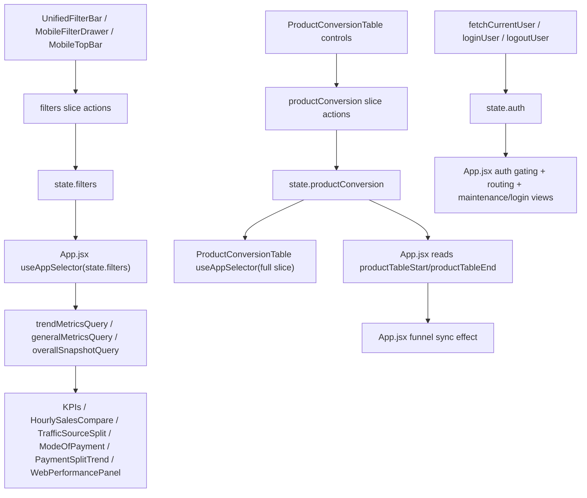
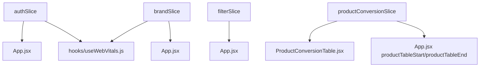
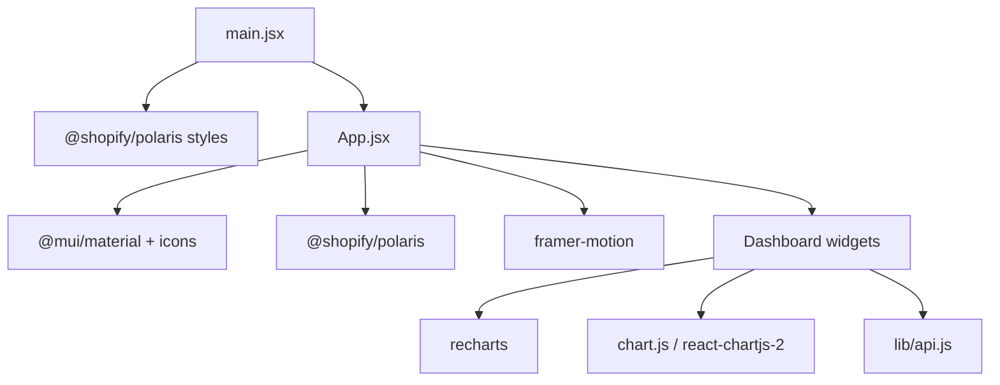
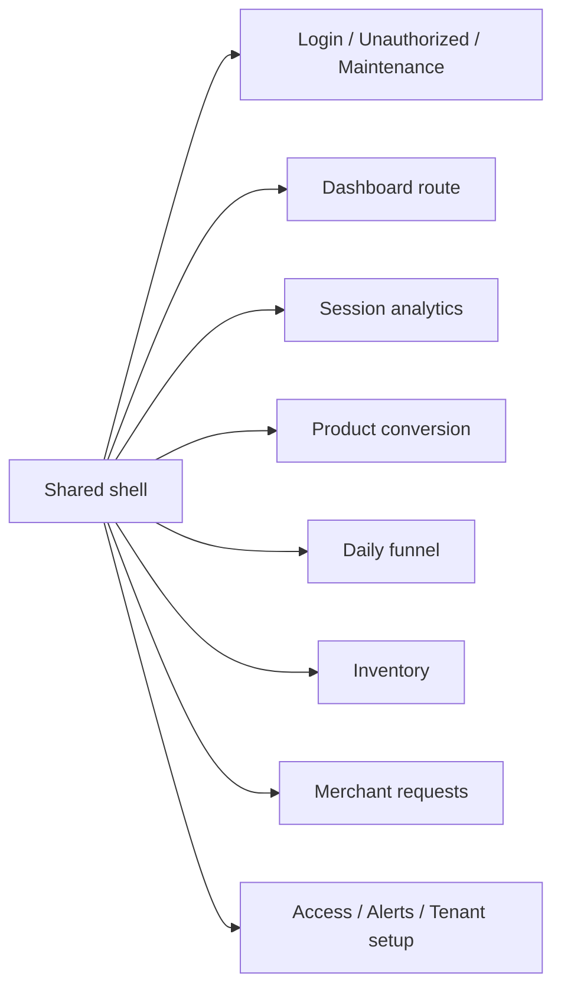

# Frontend Performance Static Deep Audit

Static audit only. This document is derived from source code, build artifacts, and import analysis. It does **not** use browser profiling, DevTools, React Profiler, or runtime tracing.

## Executive Summary
Phase 1 already established the big themes: large startup cost, a bloated shell, widget-owned fetching, and overlapping UI/chart ecosystems. Phase 2 goes deeper and answers where the highest rerender blast radius lives, which modules are structurally expensive to maintain, and which parts of the codebase have the highest optimization ROI.

The dominant static findings are:
- `App.jsx` remains the application’s central orchestration hub and the single largest state invalidation source.
- Dashboard responsiveness risk is concentrated in a small set of heavy components: `App.jsx`, `KPIs.jsx`, `HourlySalesCompare.jsx`, `PaymentSplitTrend.jsx`, `ModeOfPayment.jsx`, `UnifiedFilterBar.jsx`, and `ProductConversionTable.jsx`.
- Redux usage is shallow but broad: there are only 4 slices, yet there are no memoized selectors and `App.jsx` directly consumes large pieces of global state.
- The API dependency graph is highly centralized around `src/lib/api.js` and repeatedly reused dashboard endpoints, especially `getDashboardSummary`, `getOrderSplit`, and `getPaymentSalesSplit`.
- The codebase has **no detected circular imports**, so complexity comes from orchestration breadth and component size rather than module cycles.
- CSS and animation complexity are concentrated in global framework overlap, Polaris overrides, framer-motion islands, and table/chart-heavy components rather than widespread custom CSS sprawl.

## 1. Component Architecture

### Source inventory
- JSX component/page files: **72**
- JS utility/hook/state files: **22**
- CSS files: **1**
- Static import edges detected: **112**

### Largest component / module files
| File | Lines | Notes |
|---|---:|---|
| `src/App.jsx` | 4,179 | Global shell and route/dashboard orchestrator |
| `src/components/ProductConversionTable.jsx` | 2,856 | Heavy table route module |
| `src/components/KPIs.jsx` | 2,493 | KPI orchestration + layout + fetch behavior |
| `src/components/AccessControlCard.jsx` | 2,168 | Large admin/config UI |
| `src/components/MerchantRequestsPanel.jsx` | 2,157 | Complex feature panel |
| `src/components/UnifiedFilterBar.jsx` | 2,122 | Shared dashboard filter surface |
| `src/components/HourlySalesCompare.jsx` | 2,015 | Chart + network fan-out + metric coordination |
| `src/components/DailyFunnelPanel.jsx` | 1,819 | Table-heavy analytics panel |
| `src/lib/api.js` | 1,581 | Central API surface |
| `src/components/MobileFilterDrawer.jsx` | 1,556 | Mobile filter orchestration |

### Top orchestration parents
| Parent module | Imported children |
|---|---:|
| `src/App.jsx` | 22 |
| `src/pages/SessionAnalytics/SessionAnalyticsPage.jsx` | 7 |
| `src/components/KPIs.jsx` | 6 |
| `src/components/ProductConversionTable.jsx` | 6 |
| `src/main.jsx` | 5 |

### Shared dependency bottlenecks
| Shared module | Importers |
|---|---:|
| `src/lib/api.js` | 30 |
| `src/lib/currency.js` | 9 |
| `src/components/ui/GlassChip.jsx` | 7 |
| `src/lib/dateRange.js` | 4 |
| `src/observability.js` | 4 |
| `src/lib/kpiLayout.js` | 4 |

### Component dependency graph

```mermaid
graph TD
  main["main.jsx"] --> App["App.jsx"]
  main --> Store["state/store.js"]
  main --> Router["BrowserRouter"]
  App --> Header["Header.jsx"]
  App --> Sidebar["Sidebar.jsx"]
  App --> UnifiedFilterBar["UnifiedFilterBar.jsx"]
  App --> MobileFilterDrawer["MobileFilterDrawer.jsx"]
  App --> KPIs["KPIs.jsx"]
  App --> HourlySalesCompare["HourlySalesCompare.jsx"]
  App --> ModeOfPayment["ModeOfPayment.jsx"]
  App --> PaymentSplitTrend["PaymentSplitTrend.jsx"]
  App --> TrafficSourceSplit["TrafficSourceSplit.jsx"]
  App --> ProductConversionTable["ProductConversionTable.jsx"]
  App --> DailyFunnelPanel["DailyFunnelPanel.jsx"]
  App --> OverallSnapshotWidget["OverallSnapshotWidget.jsx"]
  App --> MerchantRequestsPanel["MerchantRequestsPanel.jsx"]
  App --> SessionAnalyticsPage["SessionAnalyticsPage.jsx"]
  KPIs --> KPIStat["KPIStat.jsx"]
  ProductConversionTable --> SearchableSelect["ui/SearchableSelect.jsx"]
  ProductConversionTable --> GlassChip["ui/GlassChip.jsx"]
  SessionAnalyticsPage --> SessionFilters["SessionFilters.jsx"]
  SessionAnalyticsPage --> SessionTrendChart["SessionTrendChart.jsx"]
  SessionAnalyticsPage --> SessionKPIRow["SessionKPIRow.jsx"]
  SessionAnalyticsPage --> UserEngagementTable["UserEngagementTable.jsx"]
```

### Structural observations
- `App.jsx` is still the dominant composition root for both desktop and mobile dashboards, auth, permissions, routing, theme, shell layout, and multiple feature routes.
- `KPIs.jsx`, `ProductConversionTable.jsx`, `UnifiedFilterBar.jsx`, `DailyFunnelPanel.jsx`, `HourlySalesCompare.jsx`, and `MerchantRequestsPanel.jsx` behave like sub-applications rather than leaf components.
- There is only one explicit React context in this codebase (`CurrencyDisplayContext` in `src/lib/currency.js`); most complexity comes from prop drilling and top-level orchestration rather than many contexts.

## 2. State Architecture

### Global state surfaces
- Redux store slices: `auth`, `brand`, `filters`, `productConversion`
- Explicit React context: `CurrencyDisplayContext`
- Large local-state components:
  - `MerchantRequestsPanel.jsx`: **40 `useState`**
  - `DailyFunnelPanel.jsx`: **30 `useState`**
  - `BundlesPanel.jsx`: **29 `useState`**
  - `App.jsx`: **24 `useState`**
  - `ProductConversionTable.jsx`: **18 `useState`**
  - `KPIs.jsx`: **18 `useState`**
  - `UnifiedFilterBar.jsx`: **16 `useState`**
  - `MobileFilterDrawer.jsx`: **14 `useState`**

### Redux subscription map
| Slice | Subscribers | Notes |
|---|---|---|
| `auth` | `App.jsx`, `hooks/useWebVitals.js` | `App.jsx` also destructures multiple auth fields directly |
| `brand` | `App.jsx`, `hooks/useWebVitals.js` | Global brand influences many query builders |
| `filters` | `App.jsx` | Entire dashboard filter state is pulled into shell |
| `productConversion` | `App.jsx` (partial fields), `ProductConversionTable.jsx` (whole slice) | Table module owns fetch orchestration |

### Redux architecture audit
- Memoized selectors: **none detected**
- `createSelector` / `reselect`: **none detected**
- Whole-slice consumption:
  - `App.jsx` subscribes to `auth`, `brand`, `filters`
  - `ProductConversionTable.jsx` subscribes to the full `productConversion` slice
- Duplicate or overlapping state:
  - date range is tracked globally in `filters` and separately in `productConversion`
  - compare mode/date are tracked in both `filters` and `productConversion`
  - some filter-clearing logic is duplicated between reducers and caller-side orchestration

### State propagation graph

### Highest blast-radius updates
| Update source | Blast radius | Why |
|---|---|---|
| `filters` slice updates from `App.jsx` handlers | Very high | Rebuilds shell-level query objects and passes them into most dashboard widgets |
| `brand` updates | Very high | Affects brand enforcement, filter options, all dashboard queries, snapshot widgets, and tables |
| `productConversion` date updates | Medium to high | Re-fetches product table and triggers a dashboard summary sync effect in `App.jsx` |
| auth updates | High | Gate entire route tree and alternate between login/unauthorized/app shell/maintenance states |

## 3. Hook and Effect Audit

### Hook concentration
| File | `useEffect` | `useMemo` | `useCallback` | `dispatch(...)` |
|---|---:|---:|---:|---:|
| `src/App.jsx` | 35 | 42 | 33 | 41 |
| `src/DailyFunnelPanel.jsx` | 9 | 16 | 15 | 0 |
| `src/KPIs.jsx` | 9 | 12 | 0 | 0 |
| `src/MerchantRequestsPanel.jsx` | 9 | 4 | 4 | 0 |
| `src/ProductConversionTable.jsx` | 7 | 11 | 11 | 29 |
| `src/MobileFilterDrawer.jsx` | 7 | 10 | 0 | 0 |
| `src/HourlySalesCompare.jsx` | 5 | 12 | 0 | 0 |

### Most expensive effects by static risk
1. **`App.jsx` dashboard filter option effect**
   - fetches `getSummaryFilterOptions(...)`
   - broad dependencies: brand, start, end, selected product ids, sync-permission flag
   - impacts filter UI and product/UTM sync logic
2. **`App.jsx` dashboard funnel sync effect**
   - fetches `getDashboardSummary(...)` tied to `productConversion` date range
   - bridges route-specific product table state into dashboard summary state
3. **`KPIs.jsx` KPI fetch effects**
   - separate product-scoped and general summary paths
   - combines `getDashboardSummary` and `getProductKpis`
4. **`PaymentSplitTrend.jsx` series-building effect**
   - issues repeated requests via `hours.map(...)`, `currentDates.map(...)`, `comparisonDates.map(...)`
5. **`HourlySalesCompare.jsx` trend/payment composite effect**
   - similar fan-out structure and dense in-component normalization
6. **`ProductConversionTable.jsx` fetch + debounce effects**
   - synchronizes local inputs, Redux state, and thunk dispatch

### Effect quality observations
- Several effects in `App.jsx` are domain-overlapping: auth bootstrap, permissions cleanup, discount/product/UTM conflict cleanup, long-range restriction cleanup, and route synchronization all coexist in one component.
- Multiple “state cleanup” effects operate on the same filter domains, which increases cascading-update risk even when logic is correct.
- `ProductConversionTable.jsx` relies on a mutable `paramsRef` plus debounced fetch timers, which lowers render churn but increases effect complexity and maintenance cost.

## 4. Prop Stability and Render Risk

### Unstable prop patterns
High-risk components receive or create:
- query objects assembled in `App.jsx` and passed to multiple widgets
- inline callbacks for metric/filter/layout changes
- dynamically recreated chart datasets/options
- column and filter definitions built in large table components
- JSX-heavy registries (`desktopWidgetRegistry`, `mobileWidgetRegistry`) regenerated from many dependencies

### Why this matters
- `App.jsx` reconstructs widget registries inside `useMemo`, but those memos still depend on many rapidly changing values.
- Components that are memoized (`PaymentSplitTrend`, `HourlySalesCompare`, `TrafficSourceSplit`, `ModeOfPayment`, `FunnelChart`) still receive object props whose identity likely changes often.
- Static memoization exists, but prop stability is inconsistent, which limits memo effectiveness.

### Render risk matrix
Heuristic static render-risk score out of 10, based on size, hook count, selector usage, dispatch count, API ownership, transforms, listeners, chart/table use, and orchestration behavior.

| Component | Render Risk | State Complexity | Network Impact | Maintainability | Optimization ROI |
|---|---:|---:|---:|---:|---:|
| `App.jsx` | 10.0 | 10 | 9 | 10 | 10 |
| `ProductConversionTable.jsx` | 10.0 | 9 | 6 | 10 | 10 |
| `KPIs.jsx` | 10.0 | 8 | 7 | 10 | 10 |
| `AccessControlCard.jsx` | 10.0 | 7 | 2 | 9 | 10 |
| `MerchantRequestsPanel.jsx` | 10.0 | 9 | 3 | 9 | 10 |
| `UnifiedFilterBar.jsx` | 10.0 | 8 | 4 | 9 | 10 |
| `HourlySalesCompare.jsx` | 10.0 | 8 | 10 | 9 | 10 |
| `DailyFunnelPanel.jsx` | 10.0 | 9 | 4 | 9 | 10 |
| `MobileFilterDrawer.jsx` | 10.0 | 7 | 4 | 8 | 10 |
| `OverallSnapshotWidget.jsx` | 10.0 | 6 | 3 | 8 | 10 |
| `AlertsAdmin.jsx` | 10.0 | 7 | 2 | 8 | 10 |
| `PaymentSplitTrend.jsx` | 10.0 | 6 | 10 | 8 | 10 |
| `MobileTopBar.jsx` | 10.0 | 6 | 3 | 8 | 10 |
| `BundlesPanel.jsx` | 10.0 | 8 | 3 | 8 | 10 |
| `ModeOfPayment.jsx` | 10.0 | 5 | 9 | 6 | 10 |

### Top optimization-priority component set
There are **72 JSX modules** in the app, so the “Top 100” list is effectively a full-app ranking. The highest-priority optimization candidates are:
1. `src/App.jsx`
2. `src/components/ProductConversionTable.jsx`
3. `src/components/KPIs.jsx`
4. `src/components/HourlySalesCompare.jsx`
5. `src/components/PaymentSplitTrend.jsx`
6. `src/components/UnifiedFilterBar.jsx`
7. `src/components/DailyFunnelPanel.jsx`
8. `src/components/MobileFilterDrawer.jsx`
9. `src/components/ModeOfPayment.jsx`
10. `src/components/OverallSnapshotWidget.jsx`
11. `src/components/MerchantRequestsPanel.jsx`
12. `src/components/BundlesPanel.jsx`
13. `src/components/AccessControlCard.jsx`
14. `src/components/MobileTopBar.jsx`
15. `src/components/AlertsAdmin.jsx`
16. `src/components/InventoryTable.jsx`
17. `src/components/TrafficSourceSplit.jsx`
18. `src/pages/SessionAnalytics/SessionAnalyticsPage.jsx`
19. `src/components/NotificationsMenu.jsx`
20. `src/components/OrderSplit.jsx`

## 5. Expensive Render Operations

### Highest transform density
| File | Transform signals |
|---|---|
| `ProductConversionTable.jsx` | `filter` ×14, `map` ×18, `dayjs` ×41 |
| `DailyFunnelPanel.jsx` | `sort` ×2, `filter` ×4, `map` ×18, `dayjs` ×42 |
| `AccessControlCard.jsx` | `filter` ×26, `map` ×31 |
| `App.jsx` | `sort` ×1, `filter` ×12, `map` ×19, `reduce` ×3, `JSON.stringify` ×4, `dayjs` ×13 |
| `UnifiedFilterBar.jsx` | `filter` ×7, `map` ×8, `Object.keys` ×5, `Object.values` ×3, `dayjs` ×26 |
| `BundlesPanel.jsx` | `filter` ×8, `map` ×7, `dayjs` ×33 |
| `HourlySalesCompare.jsx` | `filter` ×11, `map` ×21, `Intl` ×5 |
| `PaymentSplitTrend.jsx` | `filter` ×6, `map` ×15, `reduce` ×2, `Intl` ×4 |

### Expensive render-path conclusions
- The highest-risk transform hotspots are not just charts. Table/filter/admin surfaces are equally dense.
- `dayjs` usage is especially concentrated in product/funnel/table components rather than only date-picker shells.
- `App.jsx` itself performs meaningful transformation work and stringification, which means even shell rerenders are not cheap.

## 6. JSX Complexity Audit

### Highest JSX complexity
| File | JSX lines | Conditionals | Loops | Child tags |
|---|---:|---:|---:|---:|
| `src/App.jsx` | 661 | 538 | 19 | 175 |
| `src/components/AccessControlCard.jsx` | 671 | 167 | 31 | 257 |
| `src/components/MerchantRequestsPanel.jsx` | 739 | 152 | 14 | 179 |
| `src/components/ProductConversionTable.jsx` | 627 | 182 | 18 | 206 |
| `src/components/AlertsAdmin.jsx` | 488 | 112 | 23 | 220 |
| `src/components/UnifiedFilterBar.jsx` | 482 | 271 | 8 | 156 |
| `src/components/MobileFilterDrawer.jsx` | 455 | 196 | 14 | 149 |
| `src/components/KPIs.jsx` | 437 | 730 | 11 | 102 |
| `src/components/DailyFunnelPanel.jsx` | 437 | 141 | 18 | 133 |
| `src/components/HourlySalesCompare.jsx` | 359 | 260 | 21 | 74 |

### Decomposition candidates
- `App.jsx`
- `KPIs.jsx`
- `ProductConversionTable.jsx`
- `UnifiedFilterBar.jsx`
- `DailyFunnelPanel.jsx`
- `AccessControlCard.jsx`
- `MerchantRequestsPanel.jsx`
- `HourlySalesCompare.jsx`

These are structurally expensive even before runtime cost is considered.

## 7. API Dependency Graph

### API ownership hotspots
| File | API call signals |
|---|---:|
| `src/App.jsx` | 10 |
| `src/components/PaymentSplitTrend.jsx` | 9 |
| `src/components/ModeOfPayment.jsx` | 8 |
| `src/components/HourlySalesCompare.jsx` | 7 |
| `src/components/KPIs.jsx` | 2 |
| `src/components/MobileFilterDrawer.jsx` | 2 |

### Duplicate endpoint usage
- `getDashboardSummary`
  - `App.jsx`
  - `KPIs.jsx`
- `getOrderSplit`
  - `App.jsx`
  - `ModeOfPayment.jsx`
  - `PaymentSplitTrend.jsx`
  - `HourlySalesCompare.jsx`
  - `OrderSplit.jsx`
- `getPaymentSalesSplit`
  - `App.jsx`
  - `ModeOfPayment.jsx`
  - `PaymentSplitTrend.jsx`
  - `HourlySalesCompare.jsx`
  - `PaymentSalesSplit.jsx`
- `getTrafficSourceSplit`
  - `App.jsx`
  - `TrafficSourceSplit.jsx`
- `getSummaryFilterOptions`
  - `App.jsx`
  - `MobileFilterDrawer.jsx`
- `getTopProducts`
  - `App.jsx`
  - `MobileFilterDrawer.jsx`

### API dependency graph

```mermaid
graph TD
  API["src/lib/api.js"] --> DashboardSummary["getDashboardSummary"]
  API --> HourlyTrend["getHourlyTrend"]
  API --> OrderSplit["getOrderSplit"]
  API --> PaymentSalesSplit["getPaymentSalesSplit"]
  API --> TrafficSourceSplit["getTrafficSourceSplit"]
  API --> SummaryFilterOptions["getSummaryFilterOptions"]
  API --> TopProducts["getTopProducts"]

  App["App.jsx"] --> DashboardSummary
  App --> HourlyTrend
  App --> OrderSplit
  App --> PaymentSalesSplit
  App --> TrafficSourceSplit
  App --> SummaryFilterOptions
  App --> TopProducts

  KPIs["KPIs.jsx"] --> DashboardSummary
  PaymentTrend["PaymentSplitTrend.jsx"] --> OrderSplit
  PaymentTrend --> PaymentSalesSplit
  HourlyCompare["HourlySalesCompare.jsx"] --> OrderSplit
  HourlyCompare --> PaymentSalesSplit
  ModeOfPayment["ModeOfPayment.jsx"] --> OrderSplit
  ModeOfPayment --> PaymentSalesSplit
  Traffic["TrafficSourceSplit.jsx"] --> TrafficSourceSplit
  MobileDrawer["MobileFilterDrawer.jsx"] --> SummaryFilterOptions
  MobileDrawer --> TopProducts
```

### Static conclusion
- API ownership is fragmented across shell + widgets + mobile filter surfaces.
- `src/lib/api.js` is both a shared utility and a structural bottleneck, imported by **30 modules**.

## 8. Bundle Ownership Audit

### Dependency ownership map
| Dependency | Importing files | Route / feature concentration |
|---|---:|---|
| `@mui/material` | 50 | Nearly every route and component |
| `@mui/icons-material` | 22 | Shared across heavy admin and filter UIs |
| `@shopify/polaris` | 7 | Shell, filter bars, funnel/product pages |
| `recharts` | 5 | Dashboard trend + funnel + session analytics |
| `chart.js` + `react-chartjs-2` | 3 | `OrderSplit`, `PaymentSalesSplit`, `TrafficSourceSplit` |
| `framer-motion` | 7 | Shell, sidebar, layout editor, KPI UI |
| `styled-components` | 2 | `SidebarToggle`, `SkyToggle` |
| `lucide-react` | 18 | Broad icon usage across shell and features |
| `dayjs` | 20 | Dates spread widely through tables/filters/components |
| `axios` | 1 | `App.jsx` only |
| `firebase` | 1 | `firebase.js` only |

### Ownership conclusions
- MUI is the real default component system.
- Polaris is not everywhere, but it is globally loaded from `main.jsx`.
- Chart ownership is split between Recharts and Chart.js, with both chart stacks touching dashboard-critical routes.
- `styled-components` is a small import surface but still introduces a second styling runtime on top of MUI/Emotion.
- `axios` is only used in `App.jsx`; the rest of the app already uses `fetch` wrappers.

## 9. Lazy Loading Opportunity Map

### Current state
- `App.jsx` declares **29 lazy imports**
- `Suspense` boundaries are concentrated inside `App.jsx`
- Route code splitting exists, but orchestration remains centralized

### High-confidence lazy-load candidates
| Feature | Current static state | Lazy-load value |
|---|---|---|
| Login / unauthorized / maintenance views | still inside `App.jsx` shell | reduce unauthenticated startup |
| Dashboard widgets | lazy imported but still assembled in shell | isolate dashboard concerns better |
| `ProductConversionTable.jsx` | already lazy from shell | keep but move orchestration out of shell |
| `DailyFunnelPanel.jsx` | already lazy | same as above |
| `InventoryTable.jsx` | already lazy | route/container isolation still needed |
| `MerchantRequestsPanel.jsx` | already lazy | high-value due to 2,157 lines |
| `AccessControlCard.jsx` | already lazy | admin-only weight |
| `AlertsAdmin.jsx` | already lazy | admin-only weight |
| `SessionAnalyticsPage.jsx` | already lazy | route-local state should move with it |
| Widget editors / layout editors | partly eager in shared shell flow | defer until edit mode |

### Static conclusion
The lazy-loading opportunity is no longer “add more lazy imports”; it is “make the lazy boundaries meaningful by moving orchestration behind them.”

## 10. CSS Architecture Audit

### CSS facts
- CSS files in repo: **1**
- `src/index.css` lines: **321**
- Polaris selector mentions: **25**
- `[data-theme=...]` selectors: **16**
- `!important` uses: **31**

### Architecture observations
- CSS architecture is primarily framework-driven:
  - Tailwind base/components/utilities
  - Polaris global stylesheet from `main.jsx`
  - MUI runtime styling
  - custom global overrides in `index.css`
- `index.css` contains many dark-mode Polaris overrides and specificity workarounds.
- The combination of Polaris CSS + MUI + custom theme overrides is the main complexity source, not file count.

### Static CSS risk
- High global reach from `main.jsx` imports
- many `!important` rules suggest framework-overlap friction
- heavy reliance on global selectors for Polaris theming

## 11. Animation Audit

### Animation ownership
| File | framer-motion signals | CSS transition signals |
|---|---:|---:|
| `src/components/ui/AnimeNavBar.jsx` | 15 | 0 |
| `src/App.jsx` | 12 | 5 |
| `src/components/DashboardLayoutEditor.jsx` | 12 | 0 |
| `src/components/ui/SidebarToggle.jsx` | 10 | 1 |
| `src/components/KPIs.jsx` | 10 | 0 |
| `src/components/InlineDashboardLayoutEditor.jsx` | 7 | 2 |
| `src/components/Sidebar.jsx` | 6 | 0 |
| `src/components/ui/SkyToggle.jsx` | 0 | 20 |

### Highest static animation risk
1. `KPIs.jsx` due to page animation + layout edit interactions
2. `App.jsx` due to shell-level `AnimatePresence` / motion coordination
3. `DashboardLayoutEditor.jsx` / `InlineDashboardLayoutEditor.jsx` due to drag/edit flows
4. `Sidebar.jsx` and `SidebarToggle.jsx` due to navigation affordance animation in the shared shell
5. `TrafficSourceSplit.jsx` due to Chart.js animation plus requestAnimationFrame count-up logic

## 12. Event Listener Audit

### Listener ownership
| File | Listeners | Removals | Notes |
|---|---:|---:|---|
| `hooks/useSessionHeartbeat.js` | 4 | 4 | `focus`, `blur`, `visibilitychange`, `beforeunload` |
| `components/MerchantRequestsPanel.jsx` | 3 | 3 | resize + token/storage auth events |
| `App.jsx` | 2 | 2 | scroll + auth session event |
| `components/ProductConversionTable.jsx` | 2 | 2 | document mousemove/mouseup |
| `components/InventoryTable.jsx` | 2 | 4 | mousemove/mouseup cleanup appears duplicated but present |
| `components/NotificationsMenu.jsx` | 1 | 1 | foreground FCM event |
| `components/ui/AnimeNavBar.jsx` | 1 | 1 | resize |

### Conclusions
- Listener count is not excessive globally.
- The riskier listeners are document-level resize/drag handlers in the table components.
- Cleanup appears present for the audited listeners, so listener leaks are not the primary architectural issue.

## 13. Circular Dependency Audit
- Static import cycle detection result: **no cycles found**
- Interpretation:
  - complexity is coming from broad orchestration and oversized modules, not from import loops
  - decomposition can focus on ownership boundaries rather than cycle-breaking

## 14. Architectural Complexity Rankings

### Largest hooks / orchestration modules
| Module | Static signal |
|---|---|
| `App.jsx` | biggest shell, broadest slice subscription, most effects/memos/callbacks |
| `ProductConversionTable.jsx` | biggest table state machine |
| `KPIs.jsx` | largest KPI behavior surface |
| `DailyFunnelPanel.jsx` | large state + transform-heavy table panel |
| `HourlySalesCompare.jsx` | chart + fan-out + transform-heavy |
| `UnifiedFilterBar.jsx` | shared filter logic hub |

### Largest Redux slices
| Slice | Static complexity |
|---|---|
| `productConversionSlice.js` | most behaviorful slice, includes async thunk + persisted UI state |
| `filterSlice.js` | broad dashboard filter semantics and cross-filter coupling |
| `authSlice.js` | smaller but route-gating critical |
| `brandSlice.js` | simple but globally impactful |

### Largest utility bottlenecks
| Module | Why it matters |
|---|---|
| `src/lib/api.js` | 30 importers, single API ownership surface |
| `src/lib/currency.js` | shared formatting/context dependency |
| `src/lib/dateRange.js` | range restrictions and date-range semantics shared by shell and filters |
| `src/lib/trendSelection.js` | shared metric-selection behavior |

## 15. Optimization ROI Matrix

### Highest-ROI architectural improvements from static evidence
| Area | Render Risk | State Complexity | Bundle Impact | Network Impact | Maintainability | ROI |
|---|---:|---:|---:|---:|---:|---:|
| Decompose `App.jsx` into route/feature containers | 10 | 10 | 9 | 6 | 10 | 10 |
| Centralize dashboard widget data completely | 9 | 8 | 4 | 10 | 9 | 10 |
| Replace payment fan-out with aggregate series APIs | 8 | 5 | 2 | 10 | 8 | 10 |
| Introduce memoized selectors for shell/dashboard state | 8 | 8 | 1 | 1 | 8 | 8 |
| Stabilize widget query/handler props | 8 | 7 | 1 | 1 | 7 | 8 |
| Unify chart strategy over time | 6 | 4 | 9 | 2 | 7 | 8 |
| Reduce Polaris-in-shell reach | 5 | 3 | 7 | 0 | 6 | 6 |
| Contain table resize/filter state machines | 6 | 6 | 2 | 3 | 7 | 7 |

## 16. Engineering Artifacts

### Redux dependency graph

### Bundle ownership graph

### Lazy-loading map

## 17. Final Conclusions
- The codebase’s biggest responsiveness risk is not “too many components”; it is **too much orchestration concentrated in too few components**.
- The highest-value implementation targets are overwhelmingly architectural:
  - shell decomposition
  - dashboard data ownership consolidation
  - request fan-out removal
  - selector/prop stability work
- There are no circular-import emergencies and no evidence that listener leakage is the main bottleneck.
- The Phase 2 evidence strongly supports moving into implementation with a sequence centered on:
  1. route/shell decomposition
  2. dashboard data centralization
  3. payment trend API consolidation
  4. selector/prop stability improvements

These changes have the largest predicted responsiveness gain based on static structure alone.
